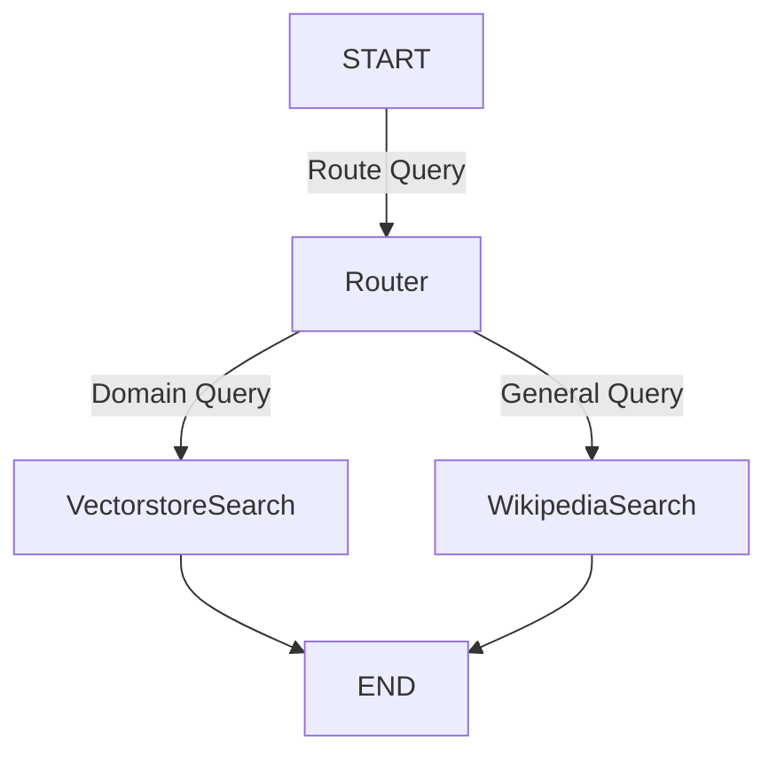

# Multi-Agent Retrieval-Augmented Generation (RAG) Model

## Overview

This project showcases a **Multi-Agent RAG system** that intelligently routes user queries to the best source—either a specialized vectorstore or Wikipedia—leveraging state-of-the-art Large Language Models (LLMs). Designed with modularity and scalability in mind, the system integrates advanced tools like LangChain, LangGraph, ChromaDB, Cassandra, and Groq's Gemma2-9b-It model, enabling autonomous query routing, semantic retrieval, and real-time web knowledge augmentation.

## Features

- **Intelligent Query Routing:** Uses an LLM-based router to dynamically decide between domain-specific vectorstore search and Wikipedia web search.
- **Multi-Agent Setup:** Distinct agents handle semantic search over indexed documents and live external data fetching.
- **Vectorstore Indexing:** Employs Cassandra and Chroma with HuggingFace embeddings for efficient semantic retrieval.
- **External Knowledge Integration:** Real-time access to Wikipedia and Arxiv for comprehensive information coverage.
- **Graph-Based Workflow:** Utilizes LangGraph for explicit, extendable workflows with conditional routing and state management.
- **Streamlined and Modular:** Easily extensible architecture for adding new data sources, memory modules, or reasoning agents.

## Architecture



- **Router:** Classifies input questions and routes appropriately.
- **VectorstoreSearch:** Retrieves answers from specialized domain knowledge.
- **WikipediaSearch:** Queries Wikipedia for general knowledge questions.

## Installation

```bash
pip install langchain langgraph langchain_community cassio chromadb langchain_huggingface tiktoken langchain-groq langchainhub arxiv wikipedia
```

> *Note:* For detailed environment setup, refer to the `Multi_Agent_RAG.ipynb` notebook.

## Setup & Usage

1. **Clone this repository and open `Multi_Agent_RAG.ipynb`.**

2. **Install required packages:**

```bash
pip install langchain langgraph langchain_community cassio chromadb langchain_huggingface tiktoken langchain-groq langchainhub arxiv wikipedia
```

3. **Configure AstraDB credentials:**

Set environment variables `ASTRA_DB_APPLICATION_TOKEN` and `ASTRA_DB_ID` with your credentials for Cassandra vectorstore access.

4. **Load and index domain documents:**

Use the notebook to load topic-specific web pages (agents, prompt engineering, adversarial attacks), split documents, and embed with HuggingFace models.

5. **Run the multi-agent workflow:**

The Groq LLM powers query routing; LangGraph orchestrates graph nodes.

### Example code to query the system

```python
inputs = {"question": "What is an agent?"}
for output in app.stream(inputs):
    print(output)
```

- Domain-specific questions return answers from the vectorstore.
- General questions are routed to Wikipedia search.

## Example Queries and Routing

| Query                                  | Routed To      | Expected Output                        |
|---------------------------------------|----------------|----------------------------------------|
| "What are the types of agent memory?" | Vectorstore    | Domain-specific detailed answer        |
| "Avengers"                            | Wikipedia      | General info fetched from Wikipedia    |
| "Who is Shahrukh Khan?"               | Wikipedia      | Real-time web search answer            |

## Technology Stack

- **LangChain & LangGraph:** Agent orchestration and graph workflow.
- **Groq LLM (Gemma2-9b-It):** Powerful LLM for decision making.
- **Cassandra & ChromaDB:** Scalable vector database storage.
- **HuggingFace Embeddings:** Semantic text encoding.
- **Wikipedia & Arxiv APIs:** Real-time external knowledge sources.

## Applications

- AI-powered research assistants with intelligent source selection.
- Enterprise autonomous question answering on mixed data.
- Hybrid semantic and live web search engines with transparent workflows.

## Resume Highlights

- Architected a dynamic, multi-agent RAG system combining semantic and web search.
- Integrated vector databases and LLMs extending Groq, LangChain, LangGraph.
- Demonstrated advanced workflows with routing, indexing, and external tool invocation.
- Deployed scalable, modular, and extensible multi-agent information retrieval solutions.

## License

Open source for educational and research demonstration purposes.

---

For more details or collaboration, please contact via your professional profile.
